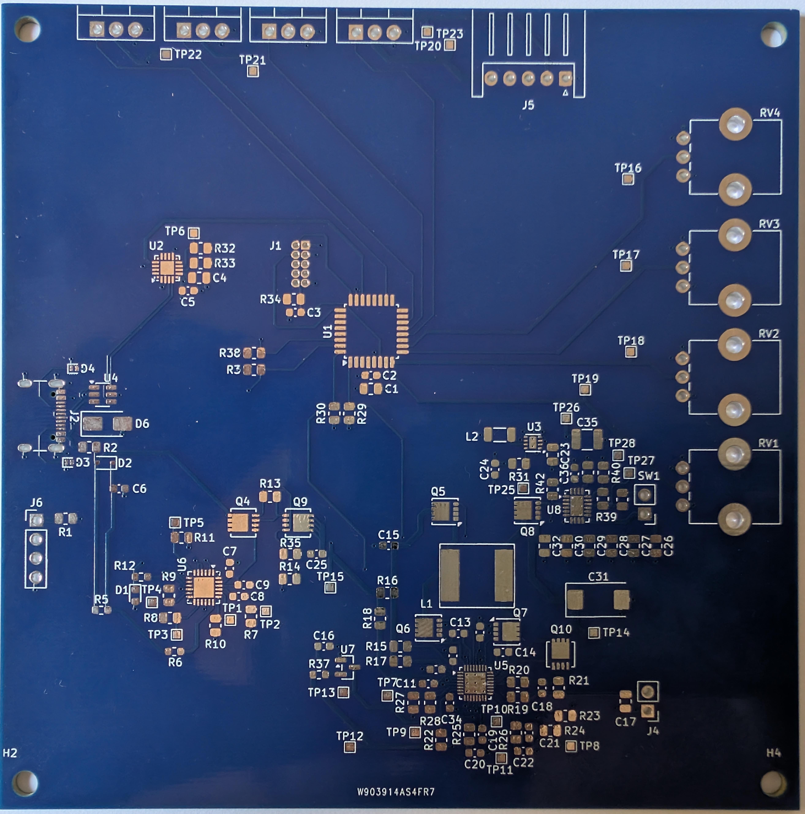

# Led Strip Project !

The goal here is to make a led strip controller board that just work.
Among other things the controller include a 3S battery and 4 potentiometer to control
RGBW independently.

The project layout is :
- hardware: kicad project to make the led strip controller board. Use KiCAD 9.
- cad: printable case for the controller + battery.
- software: software used to control the led strip. 
- ai: a setup to run CLI agent (codex) inside a docker with support for multiple AGENTS.md and support for KiMCP server.
- tools: tool to assist during development. Include KiMCP submodule.

## System requirements

- Must have a on/off switch
- Must have a battery properly scaled.
- Must provide a way to control color independently.
- Leds must be RGB with controllable intensity.
- Must provide a way to charge battery
- Must provide a way to program internal flash of MCU.
- Must be enclosed by a case.

## First board

